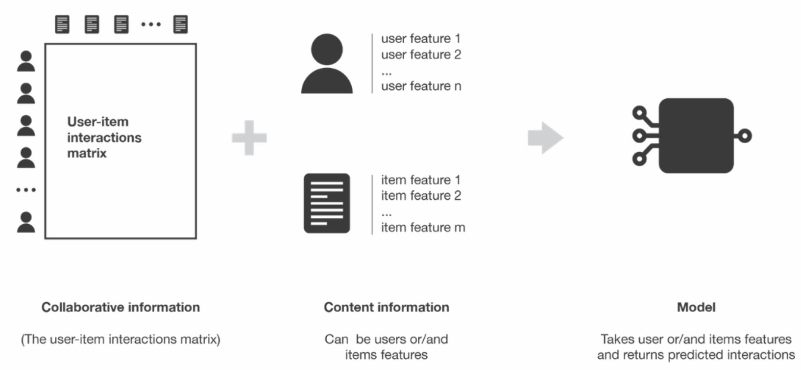

# RecSys_ITMO

## 3th task course of the Deep Learning 

## Yandex competitions
<p ></p>
Recommendation system of music for users 
based on interactions and features of items

## Architecture & example

<p align="center"></p>

## Installation
``` shell
# apt install required packages:
sudo apt update
sudo apt install -y zip htop pipenv
  
# clone repo:
https://github.com/SashaMogilevskii/RecSys_ITMO.git

# go to the folder:
cd RecSys_ITMO

# create virtualenv:
pipenv install

# activate virtualenv:
pipenv shell

# run main.py:
cd src
pipenv run python main.py


```


## Our results:

| Model           | Data               | MRR@100    | AUC  |
|-----------------|--------------------|------------|------|
| svd(scipy) v=15 | ranking.csv(short) | ----       | ---- | 
| svd(scipy) v=32 | ranking.csv(short) | ----       | ---- |


## Contributors

1. Шакиров Ренат
2. Набатчиков Илья
3. Могилевский Саша
